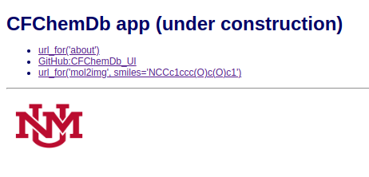
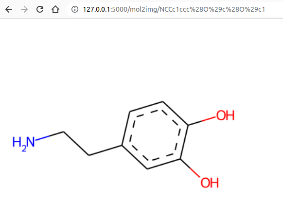

# `CFChemDb_UI`

See also:

* [CFChemDb](https://github.com/druggablegenome/idg-cfde) (repository)
* [rdkit-tools](https://github.com/jeremyjyang/rdkit-tools) (repository)
* [rdktools](https://pypi.org/project/rdktools/) (Pypi package)

## Dependencies

* [Flask](https://flask.palletsprojects.com/)
* [RDKit](https://www.rdkit.org)
  * [Installation](https://www.rdkit.org/docs/Install.html) (via conda recommended).

```
$ conda create -n rdktools -c conda-forge rdkit ipykernel
$ conda activate rdktools
(rdktools) $ conda install -c conda-forge pyvis
(rdktools) $ conda install -c conda-forge networkx=2.5
```

See also: [conda/environment.yml](conda/environment.yml) (Create with `conda env export >environment.yml`.)

## Flask

Test app:

```
(cd flask; ./Go.sh)
```

## Under construction shapshots

 * 

 * 
